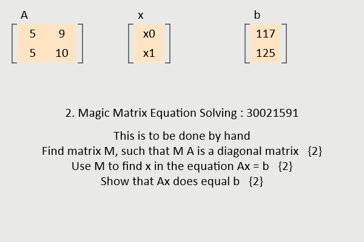
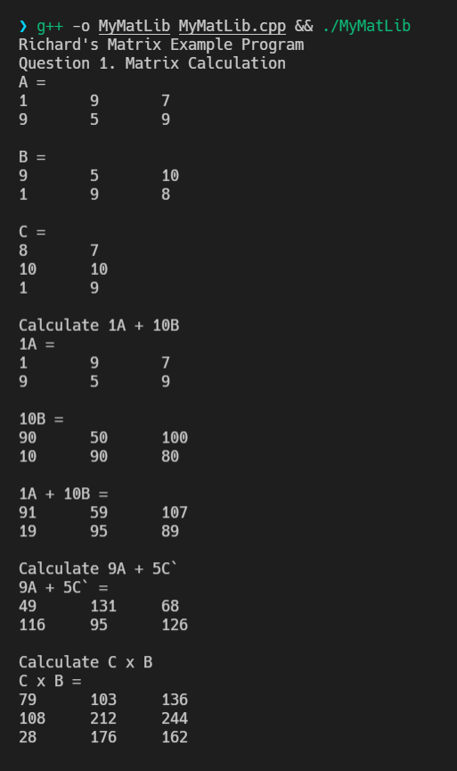

# Algorithms

**Module Code:** CS1FC16

**Assignment report Title:** Matrix and Fibonacci algorithms

**Student Number:** 30021591

**Date:** 13/022022

**Actual hrs spent for the assignment:** 12hrs

**Assignment evaluation (3 key points):** Learned how to create ## ## ## in C++. grasped the basic understand of Functional VS imperative programing and the affects on performance.

## Introduction

For this report I am instructed to create 2 sets of algorithms. One of them will print out the nth number of the fibonacci sequence using 2 different paradigm's of programing. one recursively and the other imperatively. for the other algorithm I will be using the provided matrix library to extend it to compute matrix multiplications, additions, transpose, dot product and to get a column of the matrix from the provided column number.For these algorithm I will be using the C++ programing language.

## matrix library

As stated previously i will be extending the matrix library to support matrix multiplications, additions, transpose, dot product and get column. This will be implemented using 5 functions. 

Firstly, the matrix library comes with a matrix structure.
``` C++
struct myMat {			// allows for matrices up to size 4*4
	int numRows;		// number of rows
	int numCols;
	int data[256];		// data are stored in row order //** Had to switch from 4 to something over 200 for some reason.**//
};
```

As stated the myMat struct will allow to create matrices up to 4 rows and 4 columns. The `numRows` variable and `numCols` variable stores the number of rows and columns to be created. The `data` variable holds the value of the matrix.

 To get the column of a matrix I will have to create a new matrix structure for the output. Then as shown below for every row we loop and append each element from the matrix to the output vector.
``` C++
myMat mGetCol(myMat m, int col) {
	myMat res = zeroMat(m.numRows, 1);
	for (int row = 0; row < m.numRows; row++)
		res.data[row] = getElem(m, row, col);
	return res;
}
```

Next I had to create a function to calculate the dot product of a given vector. This was simple as I had to loop over the columns and add the multiple of both the vectors to the result. This that can be outputted as a integer.
 
``` C++
int dotProd(myMat v1, myMat v2) {
	int prod = 0;
	for (int i = 0; i < v1.numCols; i++){
		prod = prod + getElem(v1,0,i) * getElem(v2,0,i);
	}
	return prod;
}
```

For `mTranspose` I created a matrix `mO` with the same number of rows and columns as the input matrix. Then using a loop each of the values of the matrix were flipped and copied to `mO`.

``` C++
myMat mTranspose(myMat m) {
	myMat mO = zeroMat(m.numCols, m.numRows);
	for(int i=0; i< m.numRows; ++i) {
		for(int j=0; j< m.numCols; ++j){
			int val = getElem(m, i, j);
			setElem(mO, j, i, val);
		}
	}
	return mO;
}
```

The matrix additions function uses a loop that get the value `i` and `j` using the `getElem` function from both the matrices and add them together. the value of it is then set to the same location in the output matrix.

``` C++
myMat mAdd(myMat m1, myMat m2) {


	myMat m3 = zeroMat(m1.numRows, m2.numCols);

	for(int i = 0; i < m1.numRows; i++) { //loop until all numbers in A and B are added to result and returned
            for(int j = 0; j < m2.numCols; j++) {
				int val = getElem(m1, i, j) + getElem(m2, i, j);
                setElem(m3, i, j, val);
            }
        }
		return m3;
}
```
For the Matrix multiplication function I created a object `m3` and if the rows and colums are equle to 1 the rows and colums are set to the number of rows and columns of the other matrix. if non of the matasies have 1 row ro colum the row on the new matrix is set to the number of rows as the first matrix and the column is sat to the number of columns as the second matrix.

Then for each row in the first matrix and the column in the second matrix get the value of i and j in the new matrix and it to the multiple of i and k from the first matrix and k and j from the second matrix. This is done until all the rows and columns have been processed.

``` C++
myMat mMult(myMat m1, myMat m2) {
	myMat m3;
	if (m1.numRows == 1 && m1.numCols == 1)
	{
		m3 = zeroMat(m2.numRows, m2.numCols);
	}else if (m2.numRows == 1 && m2.numCols == 1) {
		m3 = zeroMat(m1.numRows, m1.numCols);

	}else {
		m3 = zeroMat(m1.numRows, m2.numCols);
	}

	int val;
	
	for(int i = 0; i < m1.numRows; ++i) {
		for(int j = 0; j < m2.numCols; ++j) {
			for(int k = 0; k < m2.numRows; ++k) {
				int val = getElem(m3, i, j) + getElem(m1, i, k) * getElem(m2, k, j);
				setElem(m3, i, j, val);
			}
		}
	}
	return m3;
}
```

The Following code try's to compute the questions set by Prof Richard Mitchell on his webpages accessible [here](https://www.personal.reading.ac.uk/~shsmchlr/jsmaths/AutumnAssignment.html). The Pictures after the code show the Output of set main function.

``` C++
int main()
{
	cout << "Richard's Matrix Example Program\n";

	cout << "Question 1. Matrix Calculation\n"; // Question 1 ----------------------------
	
	myMat Q1A = mFromStr("1,9,7;9,5,9"); 		// Matrix A
	printMat("A", Q1A);

	myMat Q1B = mFromStr("9,5,10;1,9,8"); 		// Matrix B
	printMat("B", Q1B);

	myMat Q1C = mFromStr("8,7;10,10;1,9"); 		// Matrix C
	printMat("C", Q1C);

	cout << "Calculate 1A + 10B\n";

	myMat Q1_1_mat = mFromStr("1");				// create 1x1 matrix of 1 (ik its unecessary but its used to check if it works)
	myMat Q1_10_mat = mFromStr("10");			// create 1x1 matrix of 10
	myMat Q1_1A = mMult(Q1_1_mat, Q1A);			// Multiply 1 by Matrix A
	printMat("1A", Q1_1A);
	myMat Q1_10B = mMult(Q1_10_mat ,Q1B);		// Multiply 10 by Matrix B
	printMat("10B", Q1_10B);

	myMat Q1Ans1 = mAdd(Q1_1A, Q1_10B);			// Multiply 1A with Matrix 10B
	printMat("1A + 10B", Q1Ans1);				// print out the matrix


	cout << "Calculate 9A + 5C`\n";
	
	myMat Q1_9_mat = mFromStr("9");				// create 1x1 matrix of 9
	myMat Q1_5_mat = mFromStr("5");				// create 1x1 matrix of 5
	myMat Q1_9A = mMult(Q1_9_mat, Q1A);			// Multiply 9 by Matrix A
	myMat Q1_5C = mMult(Q1_5_mat, Q1C);			// Multiply 5 by Matrix C
	myMat Q1_5Ct = mTranspose(Q1_5C);			// get the transpose of the matrix 5C
	myMat Q1Ans2 = mAdd(Q1_9A, Q1_5Ct);			// Multiply 9A with Matrix 5C'
	printMat("9A + 5C`", Q1Ans2);				// print out the matrix
	
	cout << "Calculate C x B\n";

	myMat Q1Ans3 = mMult(Q1C, Q1B);				// Multiply Matrix C with Matrix B
	printMat("C x B", Q1Ans3);
	return 0;
```




## Fibonacci

Writing an algorithm to find and time Fibonacci sequences was the second task. Here I have 2 sets of styles that does the same task which is finding the nth Fibonacci number.

I have used the `chrono` library to get the execution time for each style of the Fibonacci sequences. 

To use this program `cd` into the `fibonacci` directory and type `make`. To execute the program simply type `./main` .
```
Useage: 
        ./fib [-i/-r] [count] [-t] 

        -i      imperative
        -r      recursive
        -t      output time taken
```

### imperative version

In the imperative version a desired number is passed to the function and is looped that many times, each time adding the value of `fib1` and `fib2` to `fib`. Then moving `fib2` to `fib1`. The Value of `fib` is also moved to `fib2`. Finally the value of `fib2` is returned.

``` C++
int imp_fib(int count) { // function for Fibonacci Number using the imperative methord
    std::cout << count << " Fibonacci Number using the imperative methord." << std::endl;

    for(int i = 2; i < count; i++){ 
        fib = fib1 + fib2;
        std::cout << fib2 << std::endl;
        fib1 = fib2;
        fib2 = fib;
    }
    return fib2;
}
```

### Recursive version
Using the recursive method the function here does not use a loop yet is recursively called and the previous count is inputted as an argument. depending if the value of `count` is 0, 0 is returned. if `count` is 1 then 1 is returned. else the function is called by passing the value of `count` and deducts the value by 1. the function is called again and `count` is passed as an argument this time deducts by 2. This method is usually slow as the values of previously calculated fibonacci numbers are recalculated. hence the time complexity for it is exponential.

``` C++
int rec_fib(int count) { // function for Fibonacci Number using the recursive methord
    if (count == 0)
        return 0;
    if (count == 1)
        return 1;
    return rec_fib(count-1)+rec_fib(count-2);
}
```
## Reflection

## To Do

- [x] Fibonacci

  - [x] Iterative
  
  - [x] Recursive

- [x] Function to create a matrix being a column vector from given matrix

- [x] Function to calculate the dot product of two vectors

- [x] Function to create a matrix which is the transpose of given matrix

- [x] Function to add two matrices

- [x] Function to multiply two matrices

- [ ] One to multiple each element in a matrix by a scalar
  
- [ ] One to solve a two variable matrix equation using a ‘magic’ matrix
  
- [ ] One to calculate the determinant of a 2D matrix and solve an equation using Cramer’s Rule.
